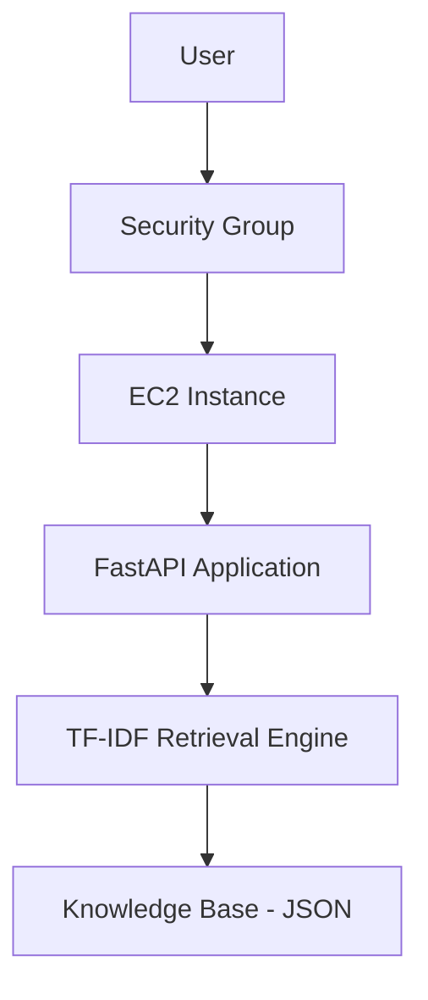
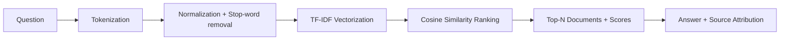

# AWS EC2 AI Chatbot

A production-oriented learning/portfolio project implementing a
retrieval-based AI chatbot backend with FastAPI, deployed to AWS EC2.
The chatbot answers questions using a from-scratch TF-IDF and cosine
similarity retrieval engine over a small AWS/backend knowledge base,
with no dependency on a paid LLM API.

## Overview

This project demonstrates backend, AI/NLP, and cloud engineering
skills together in a single, deployable service:

* A FastAPI REST API validated with Pydantic
* A dependency-free TF-IDF retrieval engine with source attribution
* Automated tests run with pytest and GitHub Actions
* A Dockerfile and Docker Compose setup for containerized runs
* Practical instructions and configuration for AWS EC2 deployment,
  including IAM and Security Group guidance

The retrieval engine is intentionally implemented from first
principles (tokenization, stop words, TF-IDF weighting, vectors,
cosine similarity) rather than by importing a large AI framework, to
demonstrate an understanding of the underlying mechanism. The
architecture keeps the retrieval layer decoupled from the API layer,
so a real LLM could be introduced later without restructuring the
project.

## Architecture



Request flow for a chat query:



## AWS Services

* **EC2** — hosts the running application on a virtual server.
* **IAM** — controls access to AWS resources; an EC2 IAM role is
  recommended over embedding access keys in code.
* **Security Groups** — act as a virtual firewall for the EC2
  instance, restricting inbound traffic by port and source IP.
* **VPC / networking** — EC2 instances run inside a VPC with subnets;
  the default VPC created by AWS is sufficient for this project, but
  understanding subnets, route tables, and internet gateways is
  useful background for more advanced deployments.

## Tech Stack

* Python 3.12
* FastAPI + Uvicorn
* Pydantic v2
* pytest + httpx (via FastAPI's TestClient)
* Docker + Docker Compose
* GitHub Actions
* AWS EC2

## Project Structure

```
aws-ec2-ai-chatbot/
├── app/
│   ├── __init__.py
│   ├── main.py
│   ├── config.py
│   ├── schemas.py
│   ├── knowledge_base.py
│   └── chatbot.py
├── data/
│   └── knowledge_base.json
├── tests/
│   ├── __init__.py
│   ├── test_health.py
│   └── test_chatbot.py
├── scripts/
│   └── seed_data.py
├── deployment/
│   ├── user_data.sh
│   └── security-group.md
├── .github/
│   └── workflows/
│       └── tests.yml
├── .env.example
├── .gitignore
├── .dockerignore
├── Dockerfile
├── docker-compose.yml
├── requirements.txt
├── pytest.ini
├── README.md
└── LICENSE
```

## How the AI Retrieval Works

1. **Tokenization** — the question and each document are split into
   lowercase alphanumeric tokens.
2. **Normalization / stop-word removal** — common low-information
   words (e.g. "the", "is", "and") are removed.
3. **TF-IDF-style representation** — each remaining token is weighted
   by how often it appears in a document (term frequency) and how
   rare it is across the whole knowledge base (inverse document
   frequency), so distinctive terms matter more than common ones.
4. **Cosine similarity** — the question's vector is compared against
   every document's vector; cosine similarity measures how closely
   their directions align, independent of document length.
5. **Ranking** — documents are sorted by similarity score, and the
   top N (configurable via `MAX_RESULTS`) are kept.
6. **Source attribution** — each returned answer includes the
   document id, title, and similarity score that produced it. If no
   document clears a minimum relevance threshold, a fallback message
   is returned instead of a low-confidence guess.

## Local Setup

### Windows (PowerShell)

```powershell
python -m venv .venv
.venv\Scripts\Activate.ps1
pip install -r requirements.txt
copy .env.example .env
uvicorn app.main:app --reload
```

### Linux / macOS

```bash
python3 -m venv .venv
source .venv/bin/activate
pip install -r requirements.txt
cp .env.example .env
uvicorn app.main:app --reload
```

The API will be available at `http://127.0.0.1:8000`, with interactive
docs at `http://127.0.0.1:8000/docs`.

## API Endpoints

### `GET /`

Returns basic service metadata.

```json
{
  "service": "AWS EC2 AI Chatbot",
  "status": "running",
  "docs": "/docs"
}
```

### `GET /health`

Returns service health and knowledge base status.

```json
{
  "status": "ok",
  "knowledge_base_documents": 11
}
```

### `POST /chat`

Request:

```json
{
  "question": "What is Amazon EC2?"
}
```

Response:

```json
{
  "question": "What is Amazon EC2?",
  "answer": "Amazon Elastic Compute Cloud (EC2) provides resizable virtual servers...",
  "sources": [
    {
      "id": "aws-001",
      "title": "Amazon EC2",
      "score": 0.71
    }
  ]
}
```

Invalid requests (empty question, question over 500 characters, or a
missing `question` field) return HTTP `422 Unprocessable Entity`.

## Running Tests

```bash
pytest
```

Tests cover the root endpoint, health endpoint, successful chat
retrieval, source attribution, input validation (empty/whitespace/too
long/malformed), and the no-result fallback path.

## Docker

Build and run with plain Docker:

```bash
docker build -t aws-ec2-ai-chatbot .
docker run -p 8000:8000 aws-ec2-ai-chatbot
```

Or with Docker Compose:

```bash
docker compose up --build
```

The API will be available at `http://localhost:8000`.

## AWS EC2 Deployment

The following steps describe a manual, learning-oriented deployment
of a single EC2 instance. AWS pricing and Free Tier eligibility vary
by account age, account type, AWS region, specific service, and usage
level — verify current pricing on the AWS website before deploying,
and do not assume a configuration will always be free.

1. **Launch an EC2 instance.** In the AWS console, choose "Launch
   Instance."
2. **Choose an AMI.** Amazon Linux 2023 or Ubuntu 22.04/24.04 LTS are
   both suitable; this project documents commands for both where they
   differ.
3. **Choose an instance type.** A small instance type (for example,
   `t3.micro` or `t2.micro`, subject to your account's Free Tier
   eligibility) is sufficient for this application.
4. **Configure the Security Group.** Follow `deployment/security-group.md`:
   restrict SSH (port 22) to your IP, and open port 8000 to your IP
   only for temporary testing.
5. **Create or select a key pair** and download the `.pem` file. Keep
   it out of version control (it is covered by `.gitignore`).
6. **Connect via SSH:**
   ```bash
   chmod 400 your-key.pem
   ssh -i your-key.pem ec2-user@<EC2_PUBLIC_IP>   # Amazon Linux
   ssh -i your-key.pem ubuntu@<EC2_PUBLIC_IP>     # Ubuntu
   ```
7. **Install required software.** On Amazon Linux:
   ```bash
   sudo dnf install -y python3 python3-pip git
   ```
   On Ubuntu:
   ```bash
   sudo apt-get update -y
   sudo apt-get install -y python3 python3-pip python3-venv git
   ```
   (`deployment/user_data.sh` automates this at instance launch time
   via the EC2 "User data" field.)
8. **Clone the repository:**
   ```bash
   git clone <your-fork-url>
   cd aws-ec2-ai-chatbot
   ```
9. **Create a virtual environment and install dependencies:**
   ```bash
   python3 -m venv .venv
   source .venv/bin/activate
   pip install -r requirements.txt
   cp .env.example .env
   ```
10. **Start the API:**
    ```bash
    uvicorn app.main:app --host 0.0.0.0 --port 8000
    ```
11. **Test from a browser** at `http://<EC2_PUBLIC_IP>:8000/health` or
    `http://<EC2_PUBLIC_IP>:8000/docs`.
12. **(Optional) Run via Docker Compose instead** of a bare virtual
    environment, after installing Docker on the instance:
    ```bash
    docker compose up --build -d
    ```
13. **Check logs.** With Uvicorn running in the foreground, logs print
    directly to the terminal; with Docker Compose, use
    `docker compose logs -f`.
14. **Stop or terminate resources when finished.** Stop the Uvicorn
    process (Ctrl+C) or `docker compose down`, and stop or terminate
    the EC2 instance from the AWS console to avoid ongoing charges.

## IAM

This project does not require any AWS API calls at runtime, so no AWS
credentials are needed inside the application or the repository. If a
future version of this project calls AWS services (for example, S3 or
RDS), the recommended approach is to attach an **IAM role** to the EC2
instance rather than storing `AWS_ACCESS_KEY_ID` / `AWS_SECRET_ACCESS_KEY`
in code, environment files, or version control. IAM roles provide
temporary, automatically-rotated credentials scoped to only the
permissions the application actually needs (least privilege).

## Security Group

See `deployment/security-group.md` for full details. In short:

* **Port 22 (SSH):** restrict the source to your own IP address.
* **Port 8000 (application):** restrict the source to your own IP
  address; this is intended for temporary manual testing, not public
  production traffic.
* Production deployments should sit behind HTTPS via a reverse proxy
  or load balancer rather than exposing Uvicorn directly.

## Environment Variables

Configuration is provided via environment variables, documented in
`.env.example`:

| Variable               | Purpose                                    | Default                     |
|-------------------------|---------------------------------------------|------------------------------|
| `APP_NAME`             | Display name of the service                | `AWS EC2 AI Chatbot`        |
| `ENVIRONMENT`          | Deployment environment label                | `development`                |
| `KNOWLEDGE_BASE_PATH`  | Path to the knowledge base JSON file        | `data/knowledge_base.json`  |
| `MAX_RESULTS`          | Max number of sources returned per answer   | `3`                           |

No secrets are required for local execution, and none are stored in
this repository.

## Cost Safety

AWS pricing and Free Tier eligibility depend on account age, account
plan, region, the specific service used, and usage volume. Always
check current pricing on the AWS website before launching resources,
monitor usage in the AWS Billing console, and stop or terminate EC2
instances when you are done testing to avoid unexpected charges.

## Security

* No secrets are committed to this repository.
* `.env`, `*.pem`, and `*.key` are excluded via `.gitignore`; only
  `.env.example` (with placeholder, non-secret values) is tracked.
* AWS credentials are never hard-coded; an EC2 IAM role is
  recommended for any future AWS API access.
* SSH access is restricted to a known IP via the EC2 Security Group.
* The application does not log secrets, and unexpected errors are
  returned to clients as generic messages rather than raw stack
  traces.

## GitHub Actions

`.github/workflows/tests.yml` runs the pytest suite automatically on
every push and pull request, using Python 3.12 on Ubuntu, giving fast
feedback before code is merged or deployed.

## Future Improvements

This is the first project in a broader AWS/AI backend portfolio.
Planned follow-on projects will introduce:

* Amazon S3 for file/object storage
* Amazon RDS (PostgreSQL) for persistent, relational data
* Vector embeddings and retrieval-augmented generation (RAG)
* Amazon ECS and ECR for containerized, orchestrated deployment
* Agent-style workflows
* Multi-service architectures

These are intentionally **not** implemented in this first project, to
keep its scope focused and its retrieval mechanism easy to understand
and explain.

## Learning Outcomes

Building and deploying this project demonstrates:

* Designing and validating a REST API with FastAPI and Pydantic
* Implementing an information retrieval algorithm (TF-IDF + cosine
  similarity) from first principles
* Writing automated tests for both happy-path and failure behavior
* Containerizing a Python service with Docker and Docker Compose
* Configuring CI with GitHub Actions
* Provisioning and securing an AWS EC2 instance, including Security
  Groups and IAM role usage
* Practicing cost-aware, secrets-safe cloud deployment habits
